<p align="center">
  
  <span style="font-size:40px"> &nbsp;→&nbsp; </span>
  
</p>

<h1 align="center">I-Hate-Hancom for Claude</h1>

<p align="center">
  <strong>한컴 서식 지옥에서 해방 — Markdown → HWPX 자동 변환 Claude Code Skill</strong>
</p>

<p align="center">
  <a href="LICENSE"></a>
  
  
  
</p>

---

## The Problem: 한컴의 문제

대한민국에는 독특한 문서 생태계가 있다. 전 세계가 `.docx`, `.pdf`, 마크다운을 쓸 때, 한국의 공공기관과 기업은 **한컴오피스 한글(`.hwp`/`.hwpx`)**을 사실상 표준으로 사용한다.

이 포맷이 비효율적인 이유는 구조적이다:

- **콘텐츠 대비 서식 비용이 과도하다**: 한컴 문서는 제목 크기, 들여쓰기, 표 테두리, 글머리 기호 등 시각적 서식을 수작업으로 지정해야 한다. 동일한 내용을 마크다운으로 작성하면 5분이면 끝날 일에 50분이 걸린다.
- **크로스플랫폼을 지원하지 않는다**: macOS와 Linux에서 정상적으로 열리지 않고, 웹 뷰어는 레이아웃이 원본과 다르게 렌더링된다. 협업 환경에서 호환성 문제가 반복된다.
- **버전 관리가 불가능하다**: `.hwp`는 바이너리 포맷이고, `.hwpx`는 ZIP 안의 XML이다. 어느 쪽이든 git diff로 변경 사항을 추적할 수 없어 협업 워크플로우에 통합되지 않는다.
- **포맷 명세가 공개되지 않았다**: HWPX에 대한 공식 스펙 문서가 사실상 존재하지 않는다. 프로그래밍 방식으로 문서를 생성하려면 리버스 엔지니어링이 유일한 방법이다.
- **사용이 관성적으로 강제된다**: 공공기관이 한컴 포맷으로 문서를 발송하면, 수신 측도 동일한 포맷으로 회신해야 한다. 기술적 우위가 아닌 관습이 선택을 결정한다.
- **AI 활용이 본질적으로 차단된다**: HWPX의 복잡한 XML 네임스페이스, 미공개 스타일 ID 체계, 바이트 단위의 구조적 민감성은 LLM이 직접 다루기에 부적합하다. 작은 오타 하나로 파일 전체가 깨지기 때문에, AI가 가장 잘하는 일 — 대량의 콘텐츠를 구조화된 문서로 빠르게 변환하는 것 — 을 한컴 포맷에서는 수행할 수 없다. 서식의 비효율이 AI 시대에 이르러 더욱 가중되는 이유다.

이 스킬은 마크다운으로 작성하고 한컴 포맷으로 출력하는 방식으로, 서식에 소비되는 시간을 구조적으로 제거한다.

---

## What This Skill Does

**마크다운이나 텍스트를 입력하면, 정부 부처 수준의 공식 HWPX 문서를 자동 생성한다.**

- 한국 정부 모범 문서를 참조한 디자인 (보도자료, 업무보고, 분석 기사, 칼럼 등)
- `▢`/`○`/`▷` 한국 공문서 기호 체계 자동 적용
- 표, 이미지, 강조 박스, 인용 박스, 섹션 헤더 지원
- Claude Code 스킬로 대화하듯 사용 — "이 마크다운을 한컴 문서로 만들어줘"

---

## Strengths & Limitations

### 할 수 있는 것

- [ ]  텍스트/마크다운 → 정부 공문서 수준 HWPX 생성
- [ ]  제목, 섹션 헤더, 불렛 리스트, 번호 리스트
- [ ]  `▢`/`○`/`▷` 한국 공문서 기호 체계
- [ ]  표 (데이터 표, 비교 표, 기관 목록 등)
- [ ]  이미지 임베딩
- [ ]  강조 박스 (노트/인포), 인용 박스 (대통령 말씀 등)
- [ ]  타이틀 박스 (국정과제 제목 등)
- [ ]  **볼드** 키워드 강조
- [ ]  다양한 문서 유형 — 보도자료, 업무보고, 분석 기사, 칼럼

### 아직 할 수 없는 것

- [ ]  복잡한 중첩 표 (병합 셀)
- [ ]  수식, 차트
- [ ]  기존 HWPX 편집 (읽기는 가능)
- [ ]  다단 레이아웃
- [ ]  머리글/바닥글 커스터마이징
- [ ]  HWP (구 바이너리 포맷) 지원

---

## Installation

### Prerequisites

- [Claude Code](https://claude.ai/code) (Desktop App 또는 CLI)
- Python 3.8+ (외부 패키지 불필요 — stdlib만 사용)

### Quick Start

**1.** 사용자 지정 → 플러그인 탐색 진입

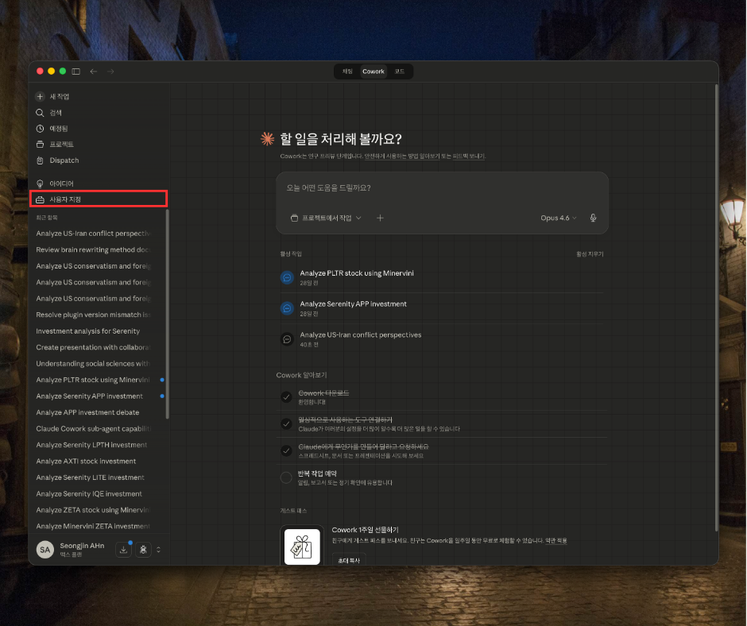

**2.** 플러그인 탐색 클릭

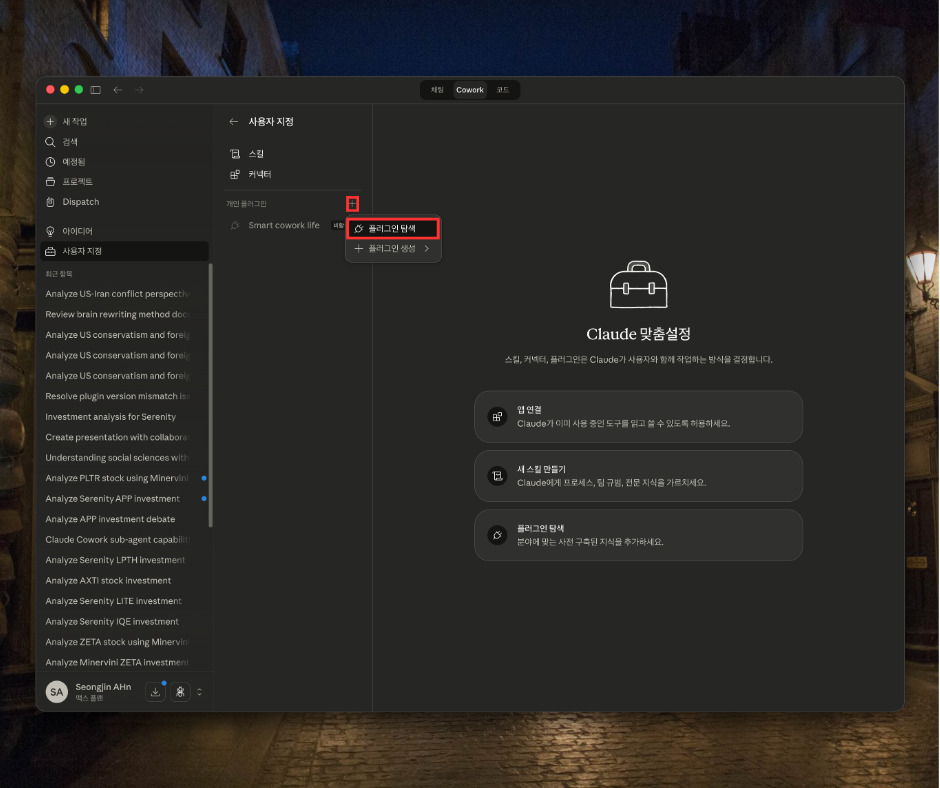

**3.** `+` → 마켓플레이스 추가

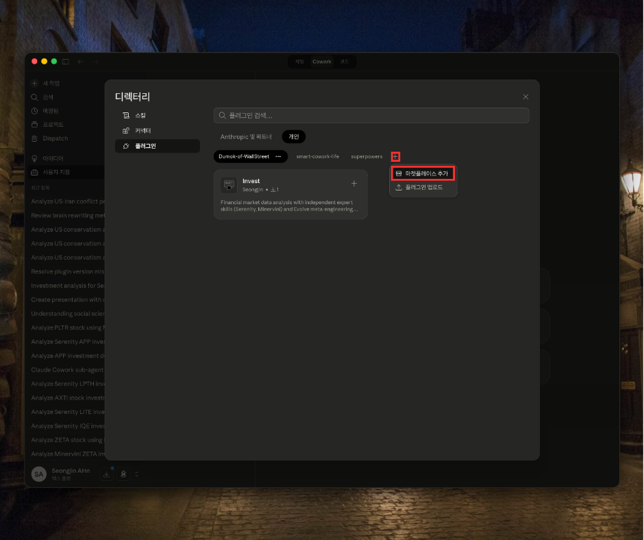

**4.** URL 입력 후 동기화

```
https://github.com/tjdwls101010/I-Hate-Hancom_for_Claude.git
```

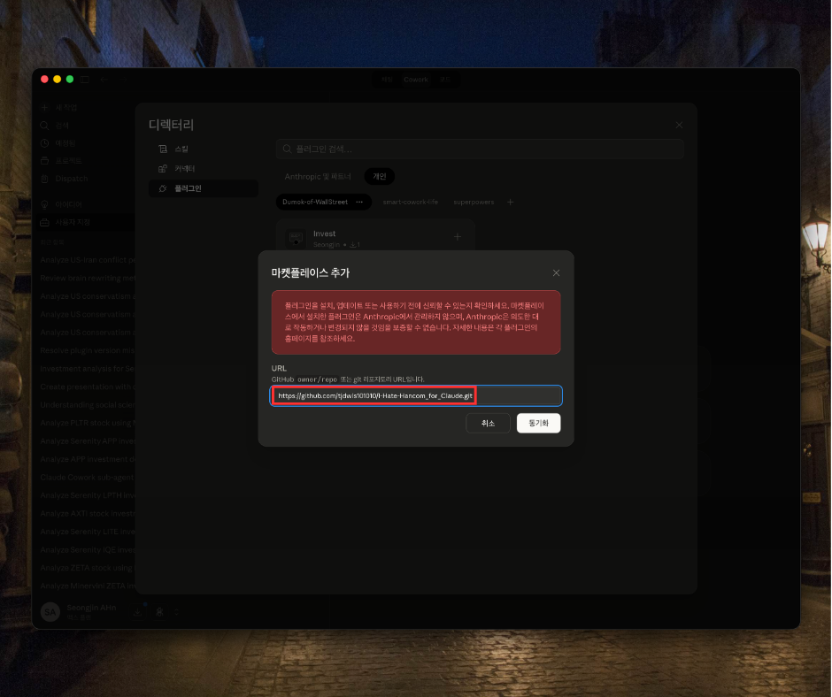

**5.** I-Hate-Hancom 플러그인 설치

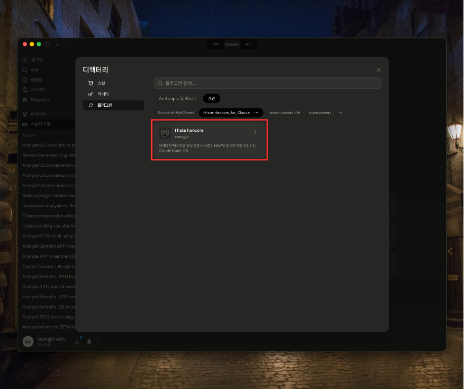

**6.** 마크다운 파일을 업로드하면 Hancom 스킬이 자동으로 트리거된다

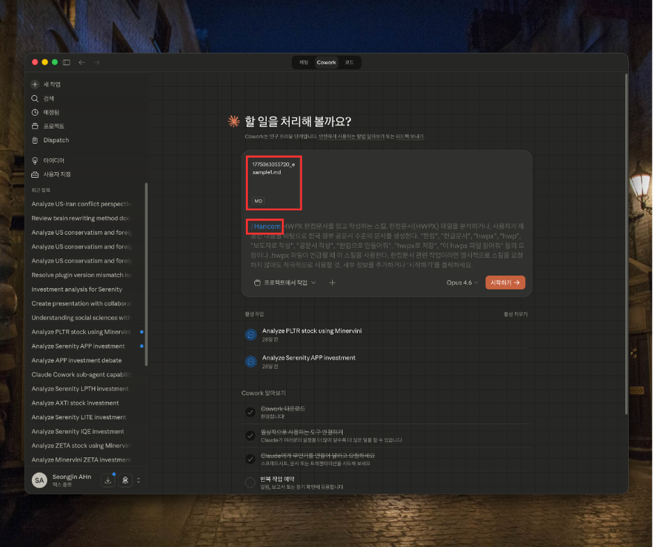

---

## Usage

마크다운 파일을 업로드하거나 자연어로 요청하면 Hancom 스킬이 자동으로 트리거된다:

<video src="https://raw.githubusercontent.com/tjdwls101010/DUMOK/main/Images/usage.mp4" controls width="600"></video>

> GitHub에서 동영상이 보이지 않으면 [직접 링크](https://raw.githubusercontent.com/tjdwls101010/DUMOK/main/Images/usage.mp4)로 확인.

Claude Code에서 자연어로 요청하면 된다:

```
"이 마크다운 파일을 한컴 공문서로 변환해줘"
"hwpx로 만들어줘"
"보도자료 형식으로 작성해줘"
"이 hwpx 파일 읽어줘"
```

### 직접 스크립트 실행

```bash
# 1. 마크다운 린트
python3 .claude/skills/Hancom/Scripts/md_lint.py input.md

# 2. 변환 + 빌드
python3 .claude/skills/Hancom/Scripts/md_to_hwpx.py input.md --output output.hwpx --build --title "문서 제목"

# 3. HWPX 읽기
python3 .claude/skills/Hancom/Scripts/read_hwpx.py document.hwpx

# 4. HWPX 검증
python3 .claude/skills/Hancom/Scripts/validate_hwpx.py document.hwpx
```

---

## How It Works

### 변환 파이프라인


| 단계 | 도구 | 하는 일 |
|------|------|---------|
| **Lint** | `md_lint.py` | 기계적 마크다운 정리 — 제목 레벨 갭, 연속 빈줄, 리스트 간 빈줄, 후행 공백 |
| **Content Prep** | Claude (수동) | 의미 판단이 필요한 정규화 — 구조 재배치, 불렛→표 변환, `<!-- box:note -->` 등 어노테이션 |
| **Convert** | `md_to_hwpx.py` | 어노테이션된 마크다운 → section0.xml (XML 템플릿 기반 생성) |
| **Build** | `build_hwpx.py` | section0.xml + header.xml + 이미지 → .hwpx ZIP 아카이브 |

### HWPX 파일 구조

HWPX는 ZIP 아카이브다. 안에 XML 파일들이 들어 있다:

```
document.hwpx (ZIP)
├── mimetype                    ← 반드시 첫 번째 엔트리 (STORED, 비압축)
├── META-INF/container.xml
├── Contents/
│   ├── header.xml              ← "CSS" — 모든 스타일을 ID로 정의
│   ├── section0.xml            ← "HTML" — 본문 내용, 스타일 ID 참조
│   └── content.hpf
├── settings.xml
└── version.xml
```

핵심 개념: **`header.xml`은 CSS, `section0.xml`은 HTML**이다. 스타일은 `header.xml`에서 ID로 정의하고, `section0.xml`에서 그 ID를 참조해 서식을 적용한다. 작은 오타 하나에도 한컴오피스가 파일을 열지 못한다.

### 왜 템플릿 기반인가 — 시행착오 이야기

**1단계: XML 직접 생성 (실패)**

처음에는 Claude가 `section0.xml` 전체를 직접 생성했다. 1,000자 분량의 콘텐츠에 5,000자 이상의 XML이 필요했다. 토큰 낭비, 네임스페이스 오류, ID 불일치가 끊이지 않았다.

**2단계: 정부 모범 문서 해체 (발견)**

실제 정부 부처 문서 10여 개를 ZIP으로 풀어 XML 구조를 분석했다. 패턴이 보였다 — 모든 문서가 동일한 XML 뼈대를 공유하고, 달라지는 건 콘텐츠와 스타일 ID 참조뿐이었다.

**3단계: 템플릿 기반 치환 (현재)**

7개의 XML 조각 템플릿(`paragraph.xml`, `run.xml`, `section_header.xml`, `box.xml`, `table_open.xml`, `table_cell.xml`, `image.xml`)에 변수를 치환하는 방식으로 전환. `header.xml`은 절대 건드리지 않고 그대로 사용한다. 빠르고, 정확하고, 토큰 효율적이다.

---

## Example Output

아래는 2025년 12월 23일 배포된 [2026년 해양수산부 업무보고](https://www.mof.go.kr/2026briefing/main/2026_bodo.pdf) 원본을 마크다운으로 역구성(reverse-making)한 뒤, 이 스킬로 HWPX를 생성한 결과물이다 ([`Docs/Examples/example3/example3.hwpx`](Docs/Examples/example3/example3.hwpx)).

이 스킬은 2026년 3월 30일부터 4월 1일까지 약 8시간을 투자해 만든 v1이다. 정부 원본 문서와 비교하면 디자인 완성도에 분명한 차이가 있다 — 다단 레이아웃, 복잡한 병합 표, 세밀한 여백 조정 등은 아직 지원하지 않는다. 그러나 공식 스펙 없이 리버스 엔지니어링만으로 8시간 만에 도달한 결과물로서, 초안(draft) 수준에서는 충분히 실용적이다. 수작업 서식 없이 구조화된 공문서 골격을 빠르게 만들어낸다는 점에 현재 버전의 가치가 있다.

한컴오피스에서 열었을 때의 실제 렌더링:

### 일반현황 — 조직도, 인원 표

섹션 헤더(초록 바), `▢` 제목, `▷` 불렛, 조직도 박스(노란 배경), 인원 현황 표가 보인다.

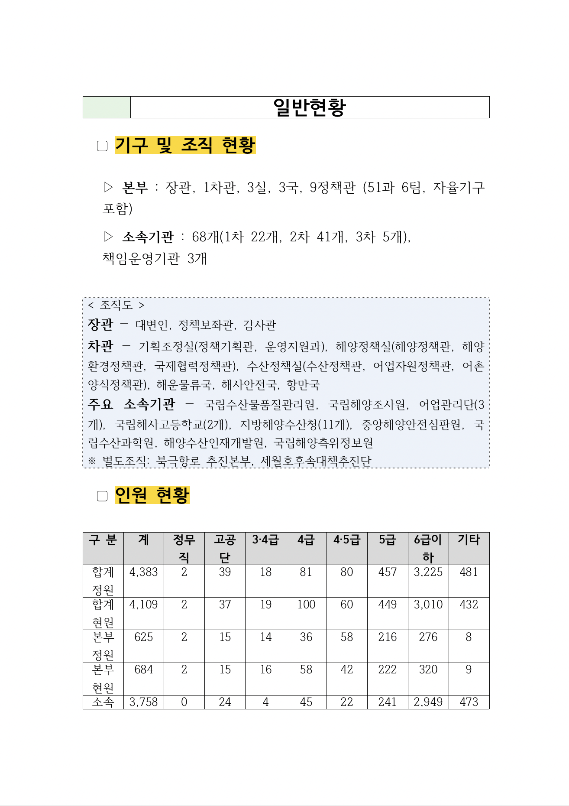

### 예산 현황 — 데이터 표, 공공기관 목록

예산 비교 표(연도별 증감), 산하 공공기관 기능·역할 표.

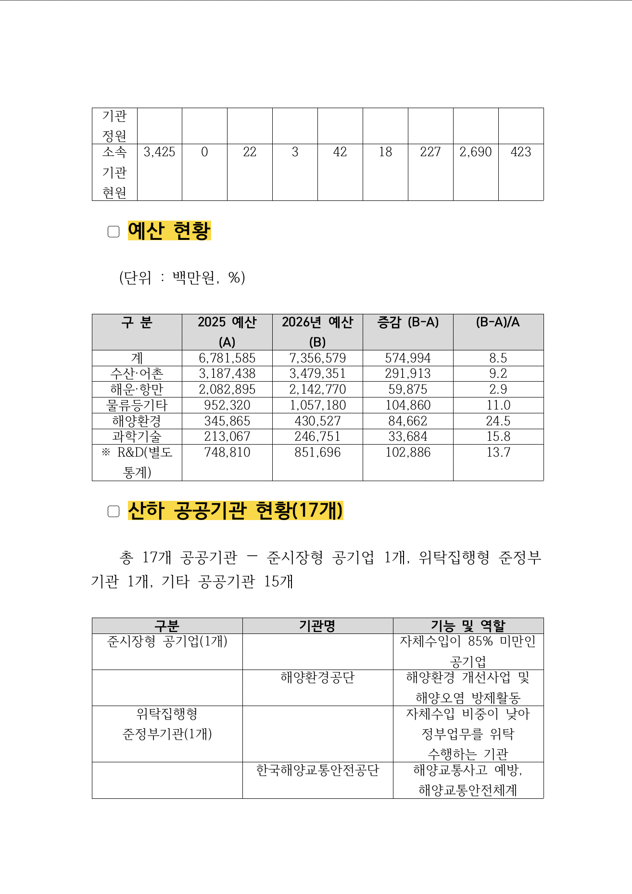

### 주요 성과 — 제목 계층 구조

`▢`→`○`→`▷` 3단계 계층 구조. `○` 수준의 파란 밑줄 제목, **볼드 키워드** 강조.

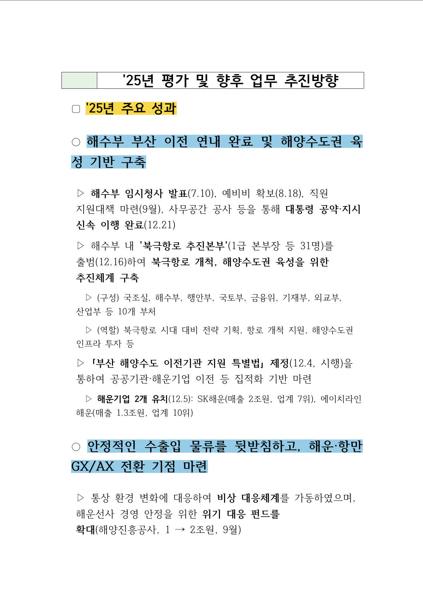

### 보완점 — 파란 음영 제목

`▢` 보완점 섹션, `○` 수준의 하늘색 음영 + 밑줄 제목.

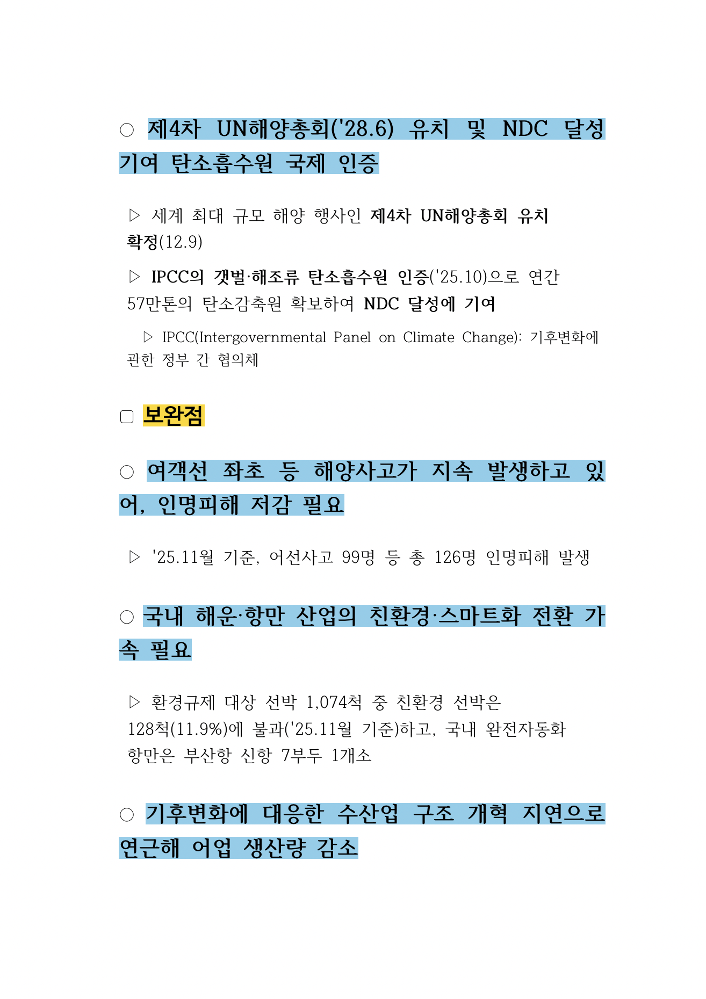

### 향후 추진방향 — 정책 비전 표

정책 비전·목표 표, 중점 추진과제 및 세부 과제 표.

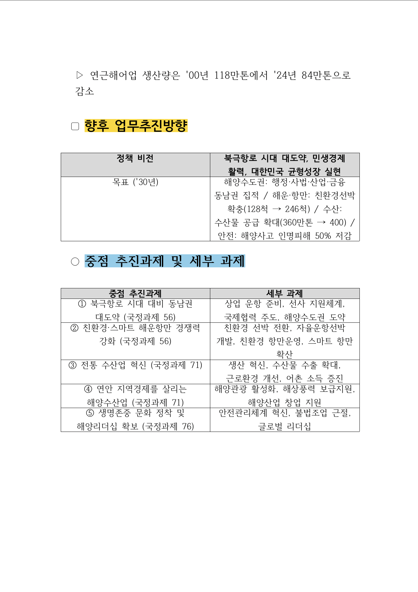

### 국정과제 상세 — 타이틀 박스, 인용 박스, 운항 일정 표

타이틀 박스(회색 테두리), 대통령 말씀 인용 박스(노란 배경), 월별 운항 일정 표, `▷` 상세 불렛.

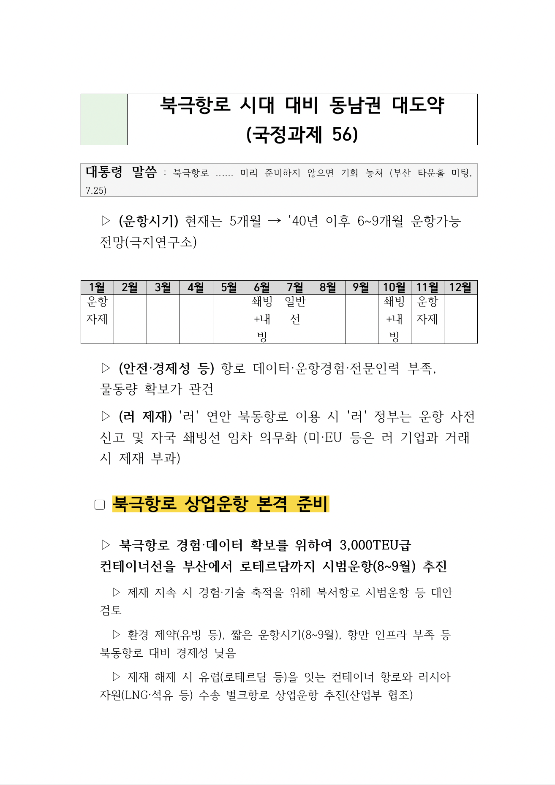

### 수산업 혁신 — 인용 박스, 노트 박스

정책 섹션 타이틀 박스, 대통령 말씀 인용, `▷` 불렛 + **볼드 키워드**, 실증 사례 노트 박스.

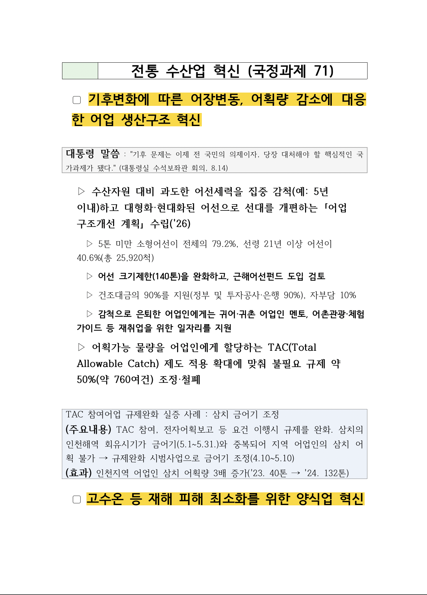

### 수출 확대 — 성공 사례 박스

`▷` 데이터 불렛, `▢` 제목 + `○` 하위 제목, 대통령 말씀 인용 박스, 김 수출 성공사례 노트 박스.

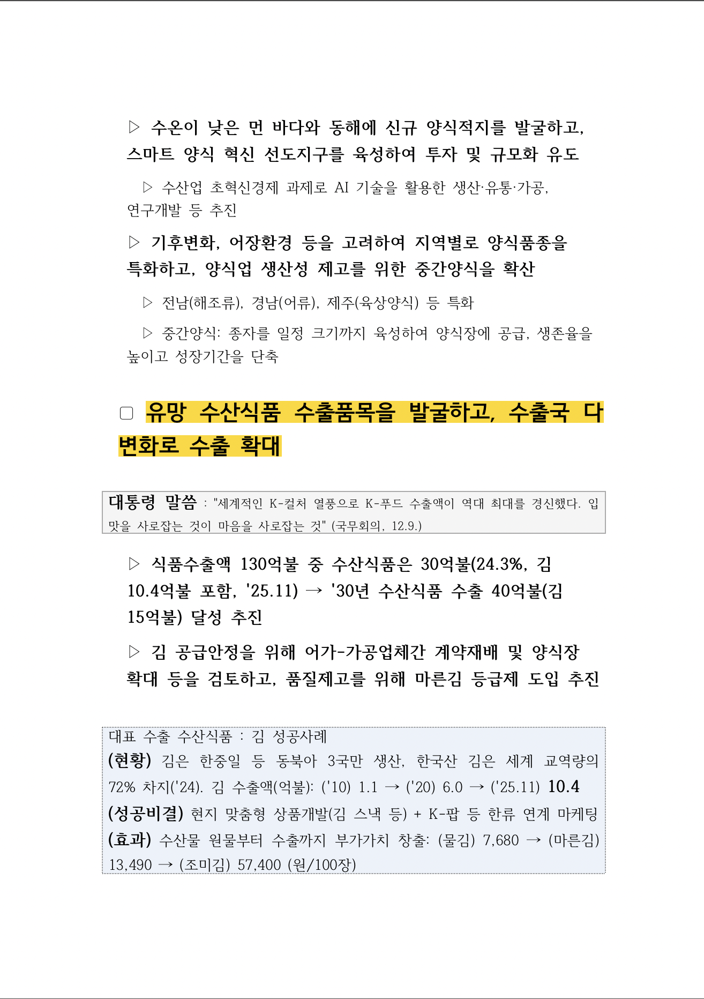

> 전체 예시 소스 파일은 [`Docs/Examples/`](Docs/Examples/)에서 확인할 수 있다 (마크다운 원본 + 변환된 HWPX).

---

## Project Structure

```
I-Hate-Hancom/
├── .claude/skills/Hancom/
│   ├── SKILL.md                         # 스킬 정의 (트리거, 워크플로우)
│   ├── Scripts/
│   │   ├── md_lint.py                   # 마크다운 린터
│   │   ├── md_to_hwpx.py               # 마크다운 → HWPX 변환기
│   │   ├── build_hwpx.py               # HWPX ZIP 빌더
│   │   ├── read_hwpx.py                # HWPX 리더
│   │   ├── validate_hwpx.py            # HWPX 검증기
│   │   └── table_fixer.py              # 표 구조 복구
│   ├── References/
│   │   ├── content-prep-guide.md        # 콘텐츠 준비 가이드
│   │   ├── document-design.md           # 문서 디자인 원칙
│   │   ├── style-catalog.md             # 스타일 ID 카탈로그
│   │   └── hwpx-format.md              # HWPX 포맷 레퍼런스
│   └── templates/
│       ├── base/                        # header.xml, mimetype 등 기본 파일
│       └── xml-parts/                   # XML 조각 템플릿 7종
│           ├── paragraph.xml
│           ├── run.xml
│           ├── section_header.xml
│           ├── box.xml
│           ├── table_open.xml
│           ├── table_cell.xml
│           └── image.xml
├── Docs/
│   ├── Examples/
│   │   ├── example1/                    # 보도자료
│   │   ├── example2/                    # 금융 분석 기사
│   │   ├── example3/                    # 정부 업무보고
│   │   ├── example4/                    # 정책 보고서
│   │   └── example3/                    # 칼럼/에세이
│   └── images/                          # README 미리보기 이미지
├── LICENSE                              # MIT License
└── README.md
```

---

## A Prayer for Markdown

> 대한민국의 모든 문서가 마크다운으로 작성되는 그날까지,
>
> 서식 맞추다 야근하는 공무원이 사라지는 그날까지,
>
> "hwp로 보내주세요"라는 말이 역사 속으로 사라지는 그날까지,
>
> 우리는 `#`과 `-`와 `>`로 저항한다.

그날이 올 때까지, 이 스킬이 당신의 시간을 조금이나마 돌려주길 바란다.

---

## License

[MIT License](LICENSE) - Copyright (c) 2026 seongjin

---

## Contributing

기여를 환영합니다. 버그 리포트, 기능 제안, PR 모두 좋습니다.

특히 다음 영역에 도움이 필요합니다:

- 병합 셀이 있는 복잡한 표 지원
- 다단 레이아웃
- 머리글/바닥글 커스터마이징
- 더 많은 문서 유형 예시
